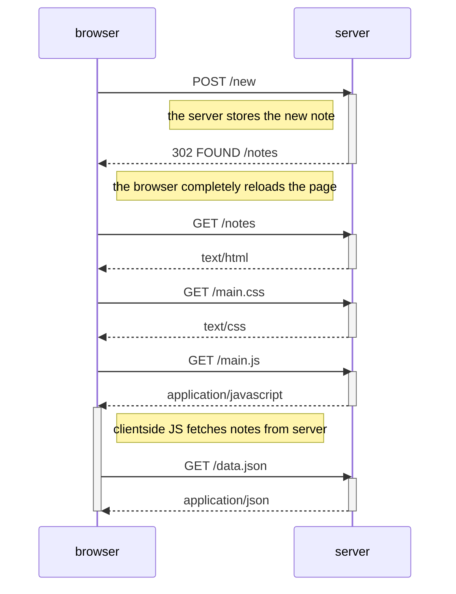
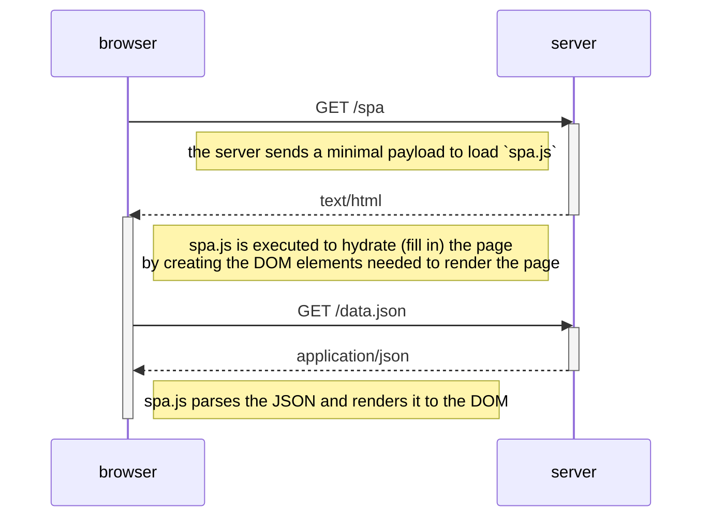
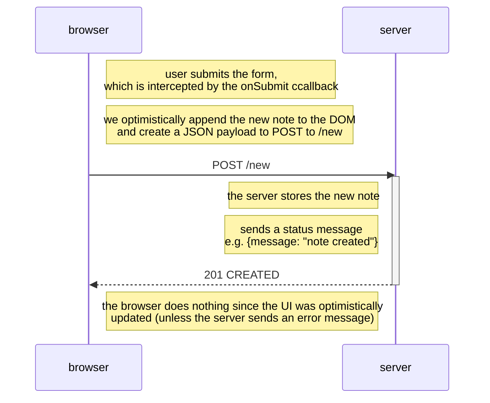

# part0
## 0.4 - New Note POST diagram
This diagram shows the process of creating a new note using a traditional architecture.

## 0.5 - SPA loading diagram
This diagram shows how the SPA app loads.

## 0.6 - New Note SPA diagram
This diagram shows how notes are created on the SPA version of the notes app.

